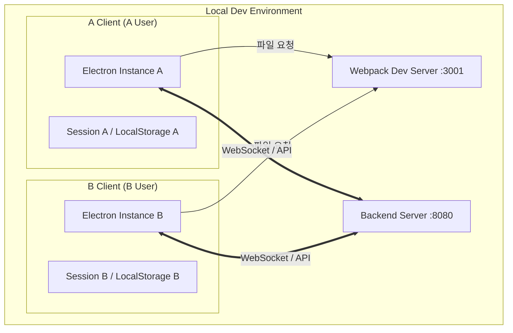

# 메신저 다중 클라이언트 실행 및 통신 확인 계획

메신저 앱 간의 실시간 메시지 송수신을 확인하기 위해서는 두 개의 독립적인 클라이언트 세션이 필요합니다.

## 세션 중복 우려에 대한 답변: 포트와 세션의 관계

사용자께서 우려하시는 "포트가 같으면 세션이 겹친다"는 점은 일반적인 웹 브라우저 테스트 시에는 맞습니다. 하지만 **Electron 환경**에서는 다음과 같은 이유로 하나의 포트(3001)만 사용해도 완벽하게 격리된 양방향 통신이 가능합니다.

### 1. 포트(Port 3001)의 역할
- **소스 코드 제공자**: 단순히 HTML/JS 파일을 앱에 전달해주는 역할을 합니다.
- **통신 통로가 아님**: 메시지를 주고받는 실제 통신은 이 포트가 아니라 **백엔드 서버(8080)**와 직접 이루어집니다.

### 2. 세션 격리의 핵심: `userData`
- Electron은 `--user-data-dir` 옵션을 통해 각 앱의 저장소(LocalStorage, 쿠키 등)를 물리적으로 분리할 수 있습니다.
- 앱 A는 기본 경로를 사용하고, 앱 B는 `./.test-runtime` 경로를 사용하도록 설정하면, 두 앱은 **서로 절대 간섭할 수 없는 독립된 브라우저**가 됩니다.

### 3. 양방향 통신 구조 (WebSocket)
두 앱이 동일한 소스 서버(3001)에서 빌드된 코드를 실행하더라도, 각자 독립적으로 백엔드(8080)에 세션을 맺습니다.



---

## 개선된 실행 방법 (스크립트 활용)

### 1. `package.json` 수정 사항
다음 스크립트를 사용하여 간편하게 실행할 수 있습니다.

```json
"scripts": {
  ...
  "electron:dev": "concurrently \"npm start\" \"wait-on http://localhost:3001 && electron .\"",
  "electron:dev:second": "electron . --user-data-dir=\"./.test-runtime\""
}
```

### 2. 실제 실행 순서
1.  **첫 번째 클라이언트**: `npm run electron:dev` 실행 (서버 구동 + 앱 1 실행)
2.  **두 번째 클라이언트**: 새 터미널에서 `npm run electron:dev:second` 실행 (앱 2만 즉시 실행)

---

## 검증 계획

### 수동 검증 (Manual Verification)
- [ ] `npm run electron:dev:second` 명령어로 두 번째 앱이 정상적으로 열리는가?
- [ ] 두 앱에서 서로 다른 계정으로 동시 로그인이 가능한가? (세션 분리 확인)
- [ ] 한쪽의 메시지가 백엔드를 거쳐 다른 쪽에 실시간으로 반영되는가? (양방향 통신 확인)
